<h1 align="center">Aaditya Chowdhury</h1>

  <b>Design Engineer</b> · I build the interfaces enterprises put in front of the world.

  Currently at <a href="https://ownpath.com"><b>Ownpath</b></a>, leading engineering for enterprise clients across
   healthcare, automotive and AI. Design systems, product surfaces, and the animation work in between.

  
  
  
  

  
  
  
  
  
  

---

## Work worth talking about

**Hero MotoCorp — apps on the EICMA Milan stage**
EICMA is the largest motorcycle show on earth. I worked with Hero's design team as lead developer on the
apps they showed there, obsessing over micro-interactions and motion until the whole thing felt premium
under the lights. Alongside that I maintain **Hero Echo**, the design system running across Vida's digital
platforms, and build internal AI tooling that reads design files and drafts technical copy so their teams
move faster.

**Philips — Heartprint**
Sole lead engineer. A PWA that reads your vitals through your phone camera: point a finger at the lens,
photoplethysmography picks up the blood-flow signal, and the app screens for heart disease risk. Careplix
SDK for capture, D3 for the real-time visualisations. Shipped to a **25% lift in daily engagement**.

**Koolio.ai — Adobe Audition, but in a browser tab**
Lead frontend on an AI audio editor built from scratch. Transcript-based editing (delete a word, the audio
goes with it), waveform manipulation via WaveSurfer, FFmpeg in the pipeline. Thousands of users.

**Symmulate Labs — founding engineer, acquired**
EdTech AI tooling. Cut LLM and RVC voice model response times by **50%**, shipped **10+ chatbot interfaces**
for education clients. The company was **acquired by Adda247** — my first exit, while still in college.

**Gastrogate AB (Sweden)** — rebuilt admin components and shipped fuzzy search for a Swedish food-tech
platform. **50% faster** search, **30%** more engagement.

**ELabs KIIT** — led the team behind a quiz platform used by **2000+ students**, and taught frontend to
**1000+** of them in person.

---

## Things I build when nobody's paying me

| Project | What it is |
|---|---|
| **[Cursor Gallery](https://cursor-gallery.vercel.app/)** | 100+ animated cursors for shadcn/ui |
| **[NeonKit](https://get-neonkit.vercel.app/)** | Neon React components, copy-paste ready |
| **[Caldy](https://caldy.vercel.app/)** | Calendar and task management, done properly |

Plenty more sitting in private repos. I'll open-source them as they're ready.

---

## Stack

`TypeScript` `React` `Next.js` `Node` `Tailwind` `Motion` `Three.js` `GraphQL` `Postgres` `MongoDB` `Python` `Go` `LangChain` `AWS`

Strongest where design meets engineering: motion, design systems, and interfaces that hold up in production.

---

## By the numbers

  
  

---

## Writing

- [From intern, to frontend developer, to selling a company](https://dev.to/aadixc0de/from-intern-to-frontend-developer-to-selling-a-company-in-college-16if)
- [How I ended up lead dev on a Philips project in college](https://dev.to/aadixc0de/how-i-ended-up-working-as-a-lead-dev-for-a-philips-project-in-college-1j0d)
- [Understanding the event loop in JavaScript](https://dev.to/aadixc0de/understanding-the-event-loop-in-javascript-made-simple-512b)

---

  Building something that needs to look and feel expensive? 
  <a href="mailto:aadityaz2077@gmail.com">aadityaz2077@gmail.com</a> · <a href="https://calendly.com/aadityaz2077/one-on-one">grab a slot</a>

